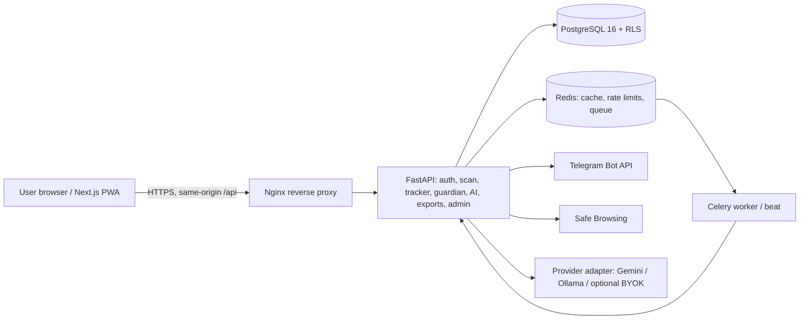

# PacShield Technical Requirements Document

**Baseline:** PacShield TRD draft 1.0, 6 October 2026; aligned to the PRD and project brain.  
**Status:** Target architecture and implementation contract. The deployed site is a static front-end demo; the production services described here have not been built or connected.

## 1. Summary and principles

The target is a three-tier web app: an installable Next.js PWA, a FastAPI service, and PostgreSQL with row-level security. Redis/Celery handle cache and slow jobs. The browser decodes QR images locally; the API validates and scores the parsed payment. A separate AI adapter can phrase the rule result. A Telegram bot carries guardian decisions.

1. Risk is computed by deterministic rules; AI never changes it.
2. The browser never uploads a QR image. QR text is untrusted input.
3. The application never requests, receives, or stores a UPI PIN.
4. Money is integer paise, not binary floating-point currency.
5. Every tenant query applies `user_id`; PostgreSQL RLS provides a second isolation layer.
6. The product remains useful when AI is offline, using fixed warning templates.
7. Admins see aggregates and verified reports, not personal transaction rows.

## 2. Target architecture



**Production components**

| Component | Responsibilities | Target runtime |
| --- | --- | --- |
| Next.js PWA | Login/setup, browser QR decode, verdict sheet, speech, money dashboard, admin screens. | Vercel or Docker. |
| Nginx | TLS termination, rate limits, request routing. Use same-origin API rewrites for first-party cookies. | Docker/hosted reverse proxy. |
| FastAPI | Authentication/RBAC, QR parsing, risk and amount rules, tracker, fixed AI tools, guardians, exports, admin. | Uvicorn; hosted API or Docker. |
| PostgreSQL 16 | User-owned records, RLS, full-text search, audit events. | Managed PostgreSQL or Docker. |
| Redis | Rate limits, blacklist/budget cache, Celery broker. | Managed Redis or Docker. |
| Celery worker/beat | Export generation, Telegram notifications, scheduled work. | Background worker. |
| External adapters | Telegram webhooks, optional Google Safe Browsing, Gemini/Ollama/user-key LLM. | Secrets in host secret store. |

## 3. Technology choices

- **Frontend:** Next.js App Router, React, TypeScript, Tailwind, accessible component primitives, Recharts, TanStack Query, Zod, `jsQR`/`html5-qrcode`, Web Speech API, PWA manifest/service worker.
- **Backend:** Python 3.12, FastAPI, Pydantic v2, SQLAlchemy 2 async, Alembic.
- **Data/queue:** PostgreSQL 16, Redis, Celery.
- **Security:** Argon2id password hashing, PyJWT or equivalent short-lived tokens, TOTP, cryptography AES-256-GCM for provider keys.
- **Reports:** pandas, openpyxl, WeasyPrint where supported.
- **Quality pipeline:** pytest/Hypothesis, API access-control tests, Playwright, ruff/mypy, ESLint/types, dependency audits, ZAP baseline.
- **Deployment:** Docker Compose as repeatable fallback; Vercel frontend, API host, managed Postgres/Redis where their current plans meet requirements.

### Deployed demo stack

The current repository uses static HTML, CSS, and browser JavaScript hosted by Vercel. `index.html` is login/registration; `home.html` is the dashboard; `ledger.js` stores manually entered transactions, budgets, and threshold-alert state in browser local storage, namespaced by demo email. The dashboard calculates the current month from those entries and alerts once per monthly budget/threshold crossing. Data is local to that browser and can be erased with browser storage; there is no API, database, bank sync, server session, or backend security. Do not treat the static account gate as production auth.

## 4. Repository layout

Target product layout:

```text
pacshield/
  frontend/                 # Next.js routes and components
  backend/app/
    auth/ security/ scan/ tracker/ guardian/ ai/ admin/ exports/
    main.py config.py db.py worker.py
  backend/migrations/ backend/tests/
  docker-compose.yml
  .github/workflows/ci.yml
```

Current demo layout:

```text
index.html                 # direct-entry login/registration demo
home.html                  # demo dashboard; requires local demo account
styles.css login.css
app.js login.js
account-assistant.css account-assistant.js
docs/                      # product/technical/flow/design specs
```

## 5. Browser QR and UPI parser contract

The QR decoder runs in the browser. The parser treats all text as untrusted data and is deterministic. Validate on the server again; the server result is authoritative.

| Field | Contract |
| --- | --- |
| Whole string | Maximum 1,024 characters; duplicate query keys rejected. |
| Scheme/host | Must be `upi://pay` for a normal payment. `collect` and `mandate` are recognized as pull/recurring risk signals. Reject all other hosts. |
| `pa` | Required VPA, lowercase-normalized, matches `^[a-z0-9._-]{2,256}@[a-z][a-z0-9]{1,63}$`. |
| `pn` | Optional payee label; strip control characters, trim, maximum 99 characters, render as text (never HTML). |
| `am` | Optional positive decimal with at most two fractional digits; convert to integer paise. If missing, ask the user to enter the amount in the UPI app. |
| `mc` | Optional four-digit merchant code. Its presence is a merchant signal, not bank identity verification. |
| `tn` | Optional note; sanitize like `pn`, maximum 80 characters. |
| Web URL | Send URL only to the Safe Browsing check; do not fetch the page or treat it as a UPI payment. |

The camera/gallery file remains on the device. Parsed text may be sent to the PacShield API for scoring under privacy policy; never send image bytes.

## 6. Risk engine contract

```text
blacklisted verified VPA             => Danger override
on_call                               +40
pull request (collect/mandate)        +30
first-time VPA                        +20
amount > 3x 30-day median             +20
personal account/no mc                +15
over personal limit                   +15
pre-filled amount                     +10
gallery image                         +10
local hour 23:00–04:59                +10
known completed payment               -20
score < 20                            Safe
20 <= score < 50                      Caution
score >= 50                           Danger
```

Clamp total at zero. Return `{level, score, reasons[]}` from pure scoring logic; never let AI supply or rewrite any of these fields. The request context is loaded server-side: known payee from user’s completed history, median of the user’s UPI payments in the last 30 days, blacklist status, personal limit, timezone/local hour, and budget state. Unit-test each signal and boundaries; tune only with documented QR fixtures.

High-amount rules are evaluated alongside scam score: over personal limit; over 3× median; more than half the remaining category budget or over budget; above safe-to-spend today. Store paise integers throughout.

## 7. Data model

Core tables/entities: `users`, `accounts`, `categories`, `transactions`, `budgets`, `planned_expenses`, `recurring_rules`, `payees`, `scan_events`, `scam_reports`, `blacklist`, `guardian_links`, `guardian_alerts`, `ai_settings`, `ai_conversations`, `refresh_tokens`, `export_jobs`, `audit_logs`.

- Every user-owned row contains `user_id` and is protected by a matching application predicate and PostgreSQL RLS (`FORCE ROW LEVEL SECURITY`). The application role is not table owner and has no `BYPASSRLS`.
- Set `app.user_id` transaction-locally on every request; never accept it as an AI-selected parameter.
- Index transaction history by `(user_id, occurred_at DESC, id DESC)`, `(user_id, category_id, occurred_at)`, and `(user_id, payee_vpa)`; add GIN full-text search for history.
- Guardian alert state transitions are atomic and pending-only: `PENDING` to `APPROVED`, `BLOCKED`, or `EXPIRED`, requiring an unexpired alert.
- Encrypt user AI credentials with AES-GCM, random 12-byte nonce, user ID as associated data, key ID for rotation; never return or log the plaintext key.

## 8. API contract (target)

Base prefix: `/api/v1`; unsafe methods require CSRF protection. Return validation failures using `application/problem+json`. Paginated lists use opaque cursors.

| Method/route | Purpose |
| --- | --- |
| `POST /auth/register`, `/verify`, `/login`, `/refresh`, `/logout`, `/logout-all` | Registration, OTP, sessions, token rotation and revocation. |
| `GET/PATCH/DELETE /me` | Current profile, update profile, delete own data. |
| `POST /scan/analyze` | Validate parsed UPI details, load user context, score, save scan event, return reasons and amount alerts. |
| `GET /scan/{id}/stream`, `POST /scan/{id}/outcome` | Guardian/result updates (SSE or polling fallback), payment outcome. |
| `POST /ai/explain`, `/ai/chat`; `GET/PUT /ai/settings` | Explain fixed result, fixed-tool chat, write-only provider settings. |
| `GET/POST /transactions`, `PATCH/DELETE /transactions/{id}` | Owner-scoped transaction history and updates. |
| `GET/POST /budgets`, `GET /dashboard/summary` | Budget management and aggregate dashboard. |
| `POST /guardian/invite`, `DELETE /guardian`, `POST /telegram/webhook` | Consent-based linking and verified callback processing. |
| `POST /reports/scam`, `POST /exports`, `GET /exports/{id}`, `GET /exports/download?token=` | Reports and short-lived export. |
| `GET /admin/reports`, `/stats`, `/audit`; `POST /admin/blacklist` | Admin-reviewed reports and aggregate-only administration. |

## 9. Authentication, privacy, and threat controls

- Hash passwords with Argon2id. Use 15-minute access credentials in `Secure`, `HttpOnly`, `SameSite` cookies and rotating hashed refresh tokens. Reuse revokes the token family.
- Login lockout/rate limits; CSRF header on unsafe cookie-authenticated requests; admin TOTP required in the target system.
- Enforce RBAC on every route and ownership filters on every query, plus forced database RLS.
- AI gets a fixed list of Pydantic-validated tools, server-injected `user_id`, max four rounds, short timeout, and minimal aggregated context. User content is data, never instructions.
- Telegram callback requires secret header, matching linked chat ID, pending state and expiry; link tokens are single-use and hashed.
- Exports use owner-checked, signed, ten-minute links; neutralize CSV formula prefixes `=`, `+`, `-`, `@`; delete generated file after use.
- Audit auth, role, export, guardian, report/blacklist changes; exclude passwords, tokens, keys, raw QR strings, and full financial detail from logs.
- Use HTTPS/HSTS, security headers/CSP, same-origin API routing, parameterized queries, rate limiting, secret manager, and dependency checks.

## 10. Operations, tests, and deployment

- Compose should run web, API, Postgres, Redis, worker, and Nginx for local demos; provide health checks and migrations.
- CI should run lint/type checks, unit tests, integration tests with real Postgres/Redis, dependency audits, and a baseline security scan.
- Unit-test parser malformed/duplicate/oversized cases, integer-paisee conversion, every score signal, score boundaries, and atomic guardian transitions.
- Integration-test cross-user access denial and admin/guardian visibility restrictions. End-to-end test login, QR verdict, guardian wait/decision, tracker, and export.
- Keep the static Vercel demo deploy separate from claims about production API readiness. The current public deployment contains a browser-local manual ledger and budget alerts, alongside demo authentication and QR/assistant features; no backend or financial integration is deployed.

## 11. Open technical decisions

- Confirm hosting supports a background worker; otherwise use a clearly bounded FastAPI background task for the demo.
- Confirm guardian has Telegram or define a consented email fallback.
- Choose OTP email provider and validate current free-tier limits before demo day.
- Decide whether voice is opt-in by default and whether a planned payment needs a separate “I planned this” state.
- Confirm deploy target and operational ownership for database backups, key rotation, incident response, and retention.

