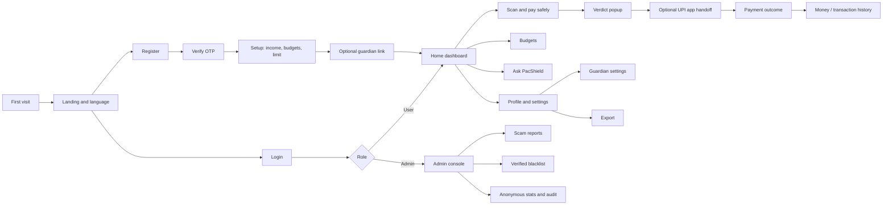
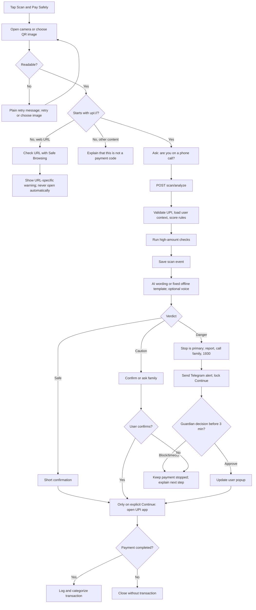

# PacShield Web Application Flow

**Source baseline:** PacShield Web App Flow draft 1.0, 6 October 2026.  
**Status:** Intended product flows plus explicit notes about the current demo routes.

## 1. Screen map

## 2. Intended routes and access

| Route | Screen | Access |
| --- | --- | --- |
| `/` | Landing and language selection | Anyone |
| `/register`, `/verify`, `/login` | Account screens | Anyone |
| `/setup` | Income, budgets, alert limit, optional guardian | New user |
| `/home` | Safe-to-spend, scan entry, safety stats | User |
| `/scan` | Camera/gallery scan and “on a call?” question | User |
| `/scan/{id}` | Verdict, guardian wait, payment outcome | User |
| `/money`, `/money/new` | Searchable history and manual transaction | User |
| `/budgets`, `/dashboard` | Budget progress, summaries, forecast | User |
| `/ask` | Assistant chat and suggested questions | User |
| `/me`, `/me/guardian`, `/me/ai`, `/me/export`, `/me/privacy` | Profile, guardian, AI key, exports, privacy | User |
| `/admin/reports`, `/admin/blacklist`, `/admin/stats`, `/admin/audit` | Report review, verified blacklist, anonymous statistics, audit | Admin only |

**Current static demo:** the production root `/` serves the login/register screen; a successful front-end demo login opens `/home.html`. A demo account stored in browser local storage is required for the dashboard route, and sign-out returns to `/`. These routes are not a production authorization boundary. Budget tracking uses manually entered records stored per email in the current browser; it does not sync across devices.

## 3. First visit, registration, and login

### New user

1. Open the landing page and select English, Hindi, or Telugu.
2. Choose registration, enter email and password, and receive/submit an OTP.
3. On valid verification, choose display name, language, currency/timezone, monthly income, personal alert limit, and overall/category budgets.
4. Offer optional guardian linking and explain what the guardian may see. Obtain consent before sending an invitation.
5. Finish at Home with sample/demo status clearly labeled where used.

### Returning user

1. Enter credentials; rate-limit and lock repeated failures. Use a generic error that does not reveal whether an email exists.
2. Verify OTP/TOTP when enabled.
3. Set a short-lived session and rotating refresh token in secure HTTP-only cookies.
4. Route by server-verified role: User to Home, Admin to the admin console.
5. Sign-out revokes the current refresh family; “sign out all” revokes all sessions.

### Current demo behavior

The static sign-in UI validates email shape and a minimum password length only. It does not authenticate an identity. The demo stores only display name/email in browser local storage, never stores/submits the password, returns the user to the dashboard, and shows a welcome notice. Direct dashboard access without demo account details returns to login.

## 4. Scan and pay safely

### Scan details

- Decode QR text locally; never upload the image. A server revalidates parsed fields before analysis.
- Reject malformed VPA, invalid/non-positive amount, repeated query keys, unsupported hosts, and strings over 1,024 characters.
- Ask whether the user is on a call. Mark gallery-origin QR as a signal when supported.
- Run deterministic risk and amount checks, save scan event, then ask AI only to phrase the returned facts. Use offline templates if AI is absent.
- Verdict uses text, icon/shape, and color. Danger places Stop/report first and largest; Continue stays locked until guardian approves or user deliberately confirms.
- Show 1930 and cybercrime.gov.in on danger screens. Never imply PacShield sees scans performed in other UPI apps.
- After optional handoff, ask whether payment completed. Record only a confirmed outcome.

## 5. Guardian flow

1. User opens Me → Guardian and sees data-sharing scope and revocation control.
2. User requests a single-use invite. A hashed token expires after ten minutes and opens a Telegram deep link.
3. Guardian taps Start. Server verifies token, identity/chat binding, consent, and single use.
4. For a danger verdict or configured limit breach, send a Telegram alert with minimal required payment context and Approve/Block buttons.
5. Alert expires after three minutes. Webhook validates the secret header, linked chat, pending status, and expiry, then performs one atomic transition and audit record.
6. Update the user popup via SSE or polling. Approval permits the user to choose whether to continue; block/timeout keeps money from being handed off and asks the user to call family.
7. Guardian sees monthly summary only if the user enabled it; revocation stops future alerts.

## 6. Money and budget flows

- Home shows income, spending, category breakdown, budget health, safe-to-spend today, forecast, scans blocked, and money saved.
- Current static app: user adds an income or expense with description, category, date, and amount. Entries are stored as integer paise in per-email browser local storage, then monthly totals, available balance, safe-to-spend, and category totals update immediately. Search filters visible current-month entries. The production target adds edit/delete and server-side persistence.
- Shield completion creates a suggested categorized transaction only after the user confirms payment completed.
- Category keyword rules run before optional AI categorization; user corrections are retained.
- Current static app: set an optional overall limit and category limits. A modal alert appears on the first crossing of 80% and 100% for each monthly limit; dismissing it does not repeat that threshold alert. The production target also checks large amounts at transaction creation.
- Export queues a personal CSV/PDF statement. Show job status and a signed download link that expires after ten minutes; remove the generated artifact after use.

## 7. Assistant, admin, and privacy flows

### Ask PacShield

Ask a spending or safety question. Use only fixed, typed tools on the server; each tool injects the authenticated user ID. If the AI is offline, keep scanning and fixed warnings available. AI replies may explain evidence but cannot change verdict or initiate a payment.

### Admin reports and blacklist

1. User reports a UPI ID, subject to rate limit.
2. Admin reviews evidence and verifies or rejects the report. A single report never adds a global blacklist entry.
3. Verified entries create an audit event. Admin statistics remain anonymous; admins cannot inspect personal transactions or provider keys.

### Privacy/export/delete

Profile explains data use and guardian/AI sharing. User can export all personal data or request deletion. Validate ownership, revoke sessions/guardian links, delete user-owned data per retention policy, and record a privacy-safe audit event.

